<nav class="navbar navbar-expand-md navbar-dark fixed-top bg-dark">
  

    <a class="navbar-brand" href="#">Yize Chen's Projects</a>
    

      <ul class="navbar-nav me-auto mb-2 mb-md-0">
        <li class="nav-item">
          <a class="nav-link active" href="https://www.linkedin.com/in/yize-chen-180901207/"><svg xmlns="http://www.w3.org/2000/svg" width="16" height="16" fill="currentColor" class="bi bi-linkedin" viewBox="0 0 16 16"><path d="M0 1.146C0 .513.526 0 1.175 0h13.65C15.474 0 16 .513 16 1.146v13.708c0 .633-.526 1.146-1.175 1.146H1.175C.526 16 0 15.487 0 14.854V1.146zm4.943 12.248V6.169H2.542v7.225h2.401zm-1.2-8.212c.837 0 1.358-.554 1.358-1.248-.015-.709-.52-1.248-1.342-1.248-.822 0-1.359.54-1.359 1.248 0 .694.521 1.248 1.327 1.248h.016zm4.908 8.212V9.359c0-.216.016-.432.08-.586.173-.431.568-.878 1.232-.878.869 0 1.216.662 1.216 1.634v3.865h2.401V9.25c0-2.22-1.184-3.252-2.764-3.252-1.274 0-1.845.7-2.165 1.193v.025h-.016a5.54 5.54 0 0 1 .016-.025V6.169h-2.4c.03.678 0 7.225 0 7.225h2.4z"/></svg></a>
        </li>
        <li class="nav-item">
          <a class="nav-link active" href="#game-development">Game development</a>
        </li>
        <li class="nav-item">
          <a class="nav-link active" href="#computer-graphics">Computer Graphics</a>
        </li>
        <li class="nav-item">
          <a class="nav-link active" href="#other-exciting-works">Other Works</a>
        </li>
      </ul>
    

  

</nav>

# Yize Chen's Portfolio

Check out more on my [Github](https://github.com/Adam-2000) and
[LinkedIn Profile](https://www.linkedin.com/in/yize-chen-180901207/)  
Email: yic093@ucsd.edu

## **Game Development**
## Space Rover
##### CS 498 Game Development Course Final Project
- 3D game developed with Unreal Engine 4 
- An adventure in the solar system that's about to explode
- Jump into the blackhole

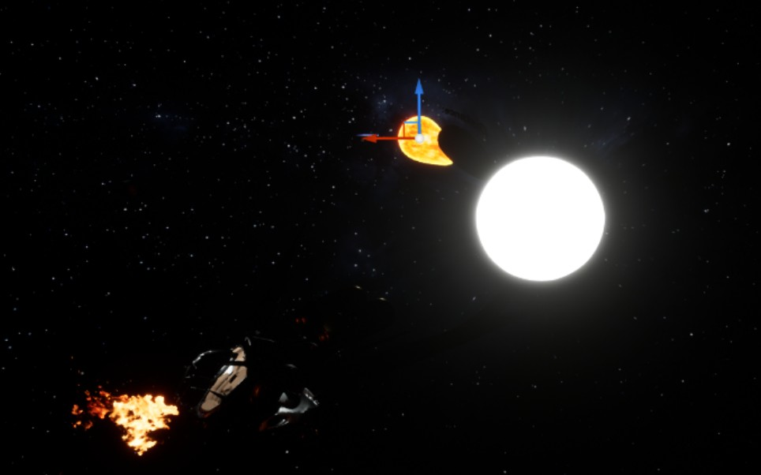
>**Check out** my [demo video](https://www.bilibili.com/video/BV16b4y1B7pc?share_source=copy_web&vd_source=8526efc45b6cabb30a409be5048ff71d) and our [project code](https://github.com/Adam-2000/SpaceRover)
>##### Inspired by [*Outer Wilds*](https://store.steampowered.com/app/753640/Outer_Wilds/)

## Shadow Ninja
##### ECE 385 Digital System Laboratory Final Project
- Side scrolling game developed on FPGA
- Frame buffer graphic output structure developed by me
- 64-color palette

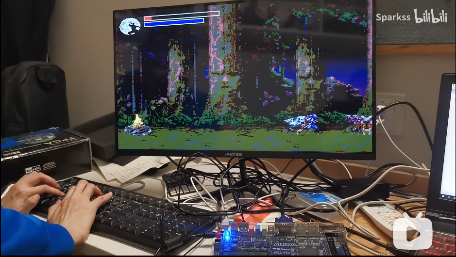
<blockquote>
  
<strong>Check out</strong> my <a href="https://www.bilibili.com/video/BV1ap4y1B7Pc?share_source=copy_web&vd_source=8526efc45b6cabb30a409be5048ff71d">demo video</a> and our <a href="https://github.com/Adam-2000/ShadowNinja">project code</a>

  <ul>
    <li>
      <h5 id="and-this-is-my-another-vr-educational-game-crystal-vision">And this is my another VR educational game <a href="https://github.com/Adam-2000/VR_CS397_4_27">Crystal Vision</a></h5>
      
 

    </li>
  </ul>
</blockquote>

 

## **Computer Graphics**
### ASCII 3D Renderer with Haskell

>**Check out** our [project code](https://github.com/TaKeTube/HaScene) 

## Ray Tracer
### Lojolla Renderer [[link]](https://github.com/Adam-2000/lajolla_public)
- Disney BSDF  
  
- Volumetric Path Tracing  
  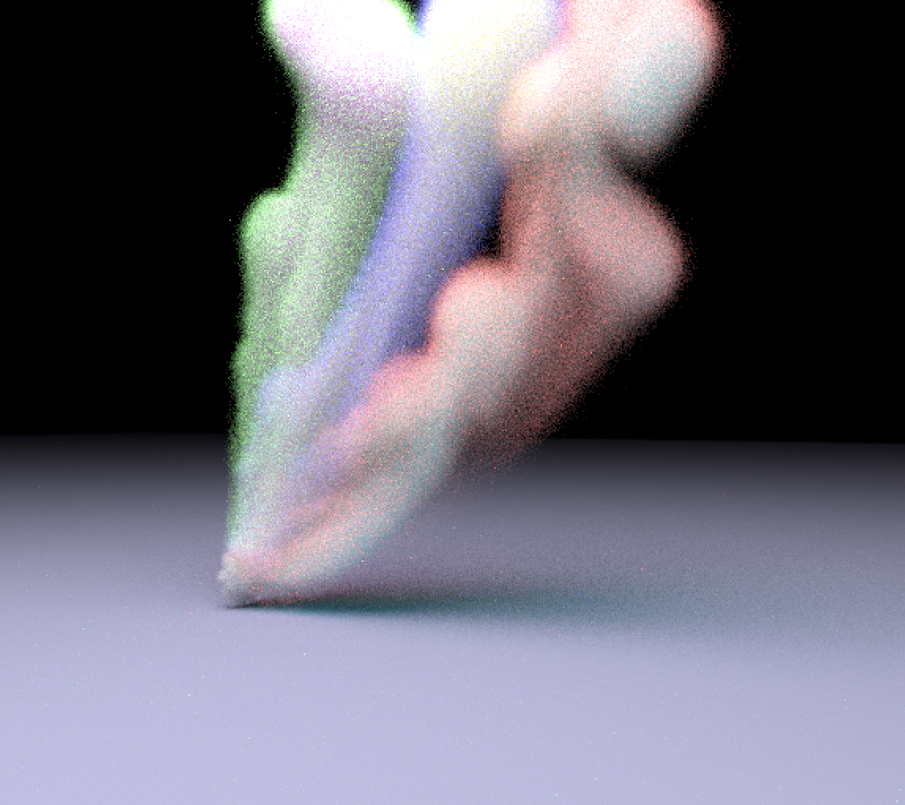 
  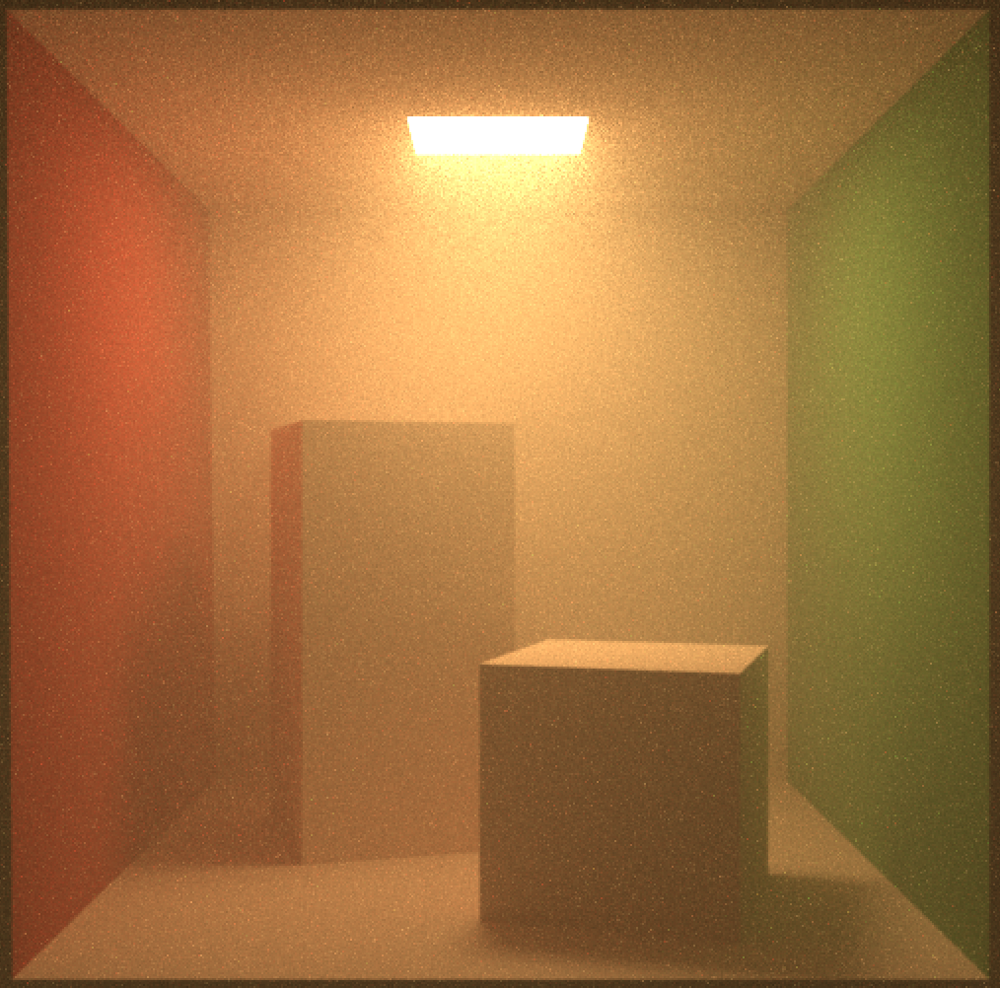
  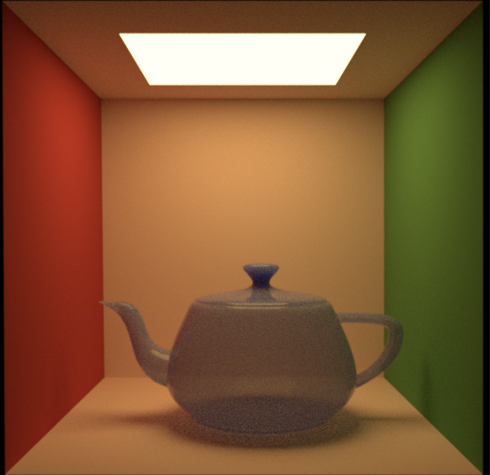
  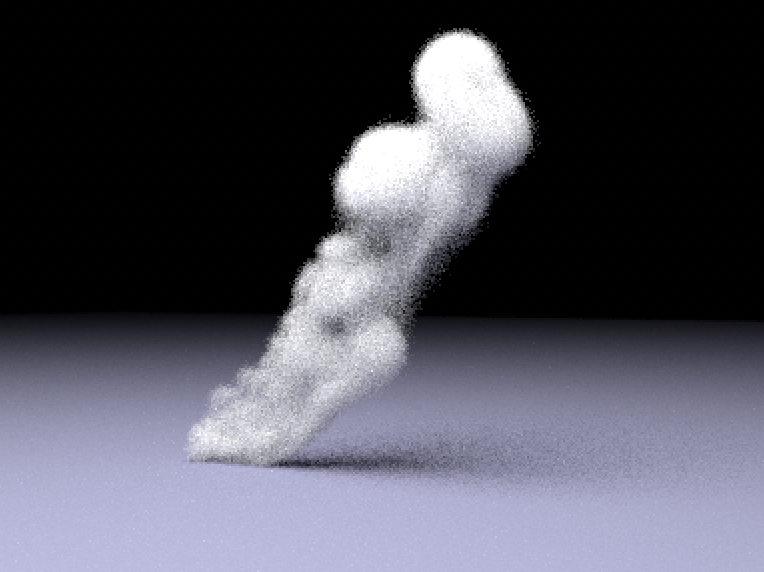 
### Previous Works
- Grid Acceleration: 40k triangles bunny rendered in 4 sec by CPU (Reduced from 20 minutes) [[link]](https://github.com/Adam-2000/MIT_6.837/tree/main/Assignment6) 
  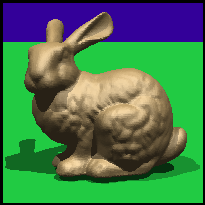 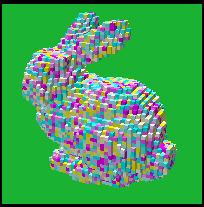  
  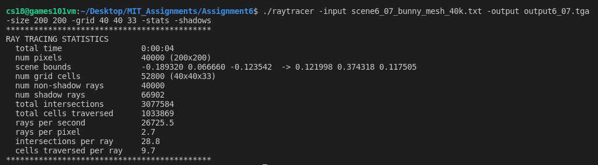
- Reflection & Refraction & Shadows & Super-Sampling Anti-Aliasing [[link]](https://github.com/Adam-2000/MIT_6.837/tree/main/Assignment7) 
  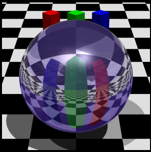 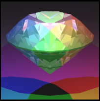 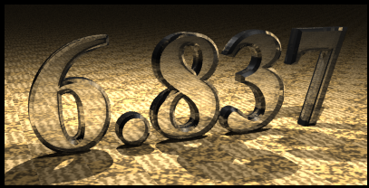
- Curves & Surfaces [[link]](https://github.com/Adam-2000/MIT_6.837/tree/main/Assignment8) 
  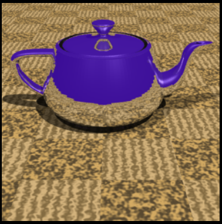 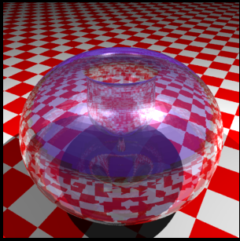

## OpenGL Shader [[link]](https://github.com/Adam-2000/OpenGL-Shader)
- Reflections and Different Texture Mappings  
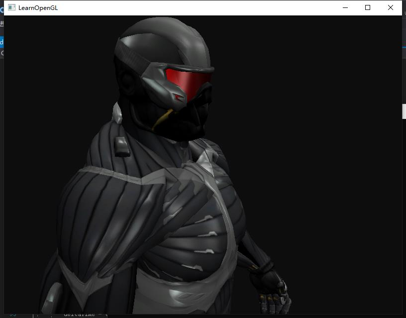

---
## **Other Exciting Works**
- Operating System - ECE 391 Course Project [[link]](https://github.com/Adam-2000/MP3_ECE391)
- Identification and Tracking of UAVs – Senior Design Project [[link]](https://github.com/zhourrr/Drone-Tracker-optical-sensors-)
- Networks and Distributed System [[link]](https://github.com/Adam-2000/ece438_github)
- GPU Convolution Kernel Optimizations [[link]](https://github.com/Adam-2000/ece408_project)
- Relational Database - CS 225 Course Project [[link]](****)
- Bear Map [[link]](https://github.com/Adam-2000/CS61B_UCBerkeley/tree/main/proj3)
 
 
---

